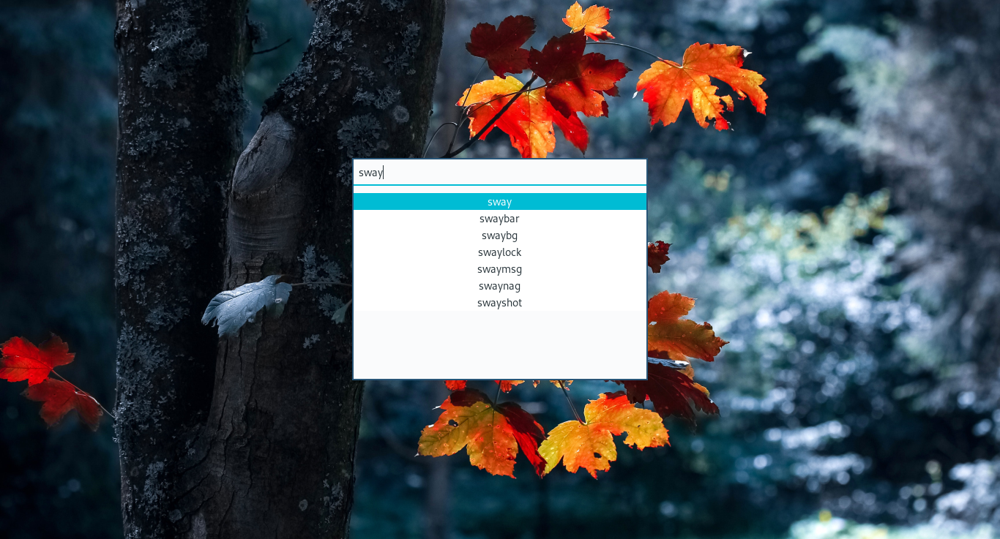

# Gbar
crossplatform demenu/rofi alternative (using gtk)

# How it looks


# Sway config example
```config
set $menu dmenu_path | gbar_client | xargs swaymsg exec
for_window [app_id="gbar"] floating enable
exec_always gbar
```
